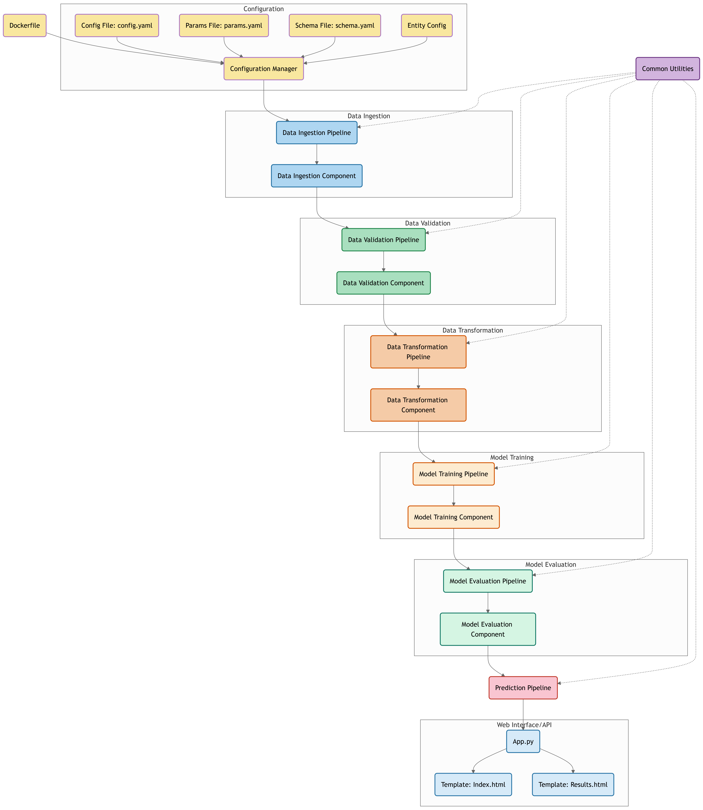
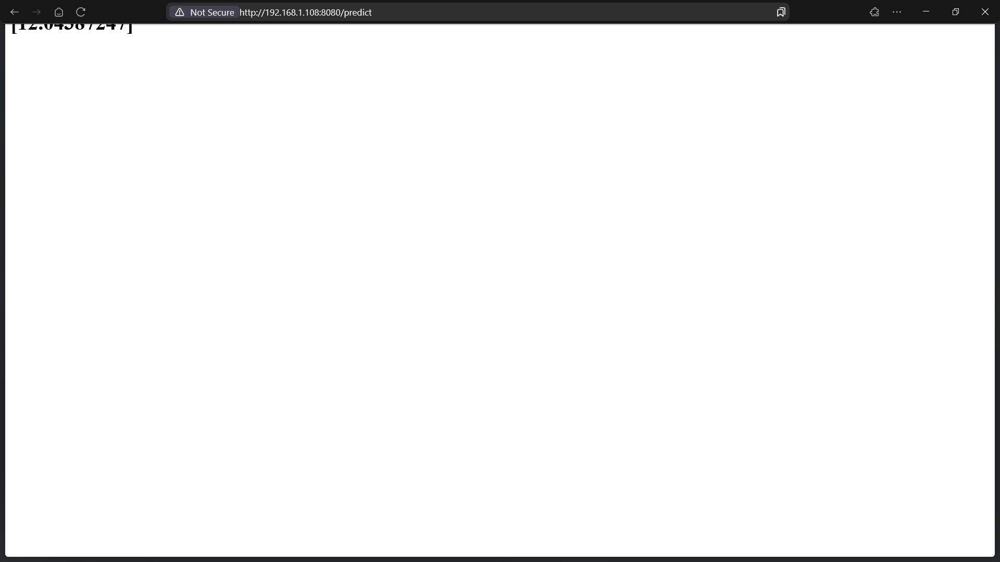

## End to End DataScience Project

### Workflow Pipeline

1. Data Ingestion 
2. Data Validation 
3. Data Transformation 
4. Model Training
5. Model Evaluation 

## Workflows

1. Update schema.yaml
2. Update params.yaml
3. Update config.yaml
4. Update the entity
5. Update the configuration manager in src config
6. Update the components
7. Update the pipeline
8. Update the main.py

